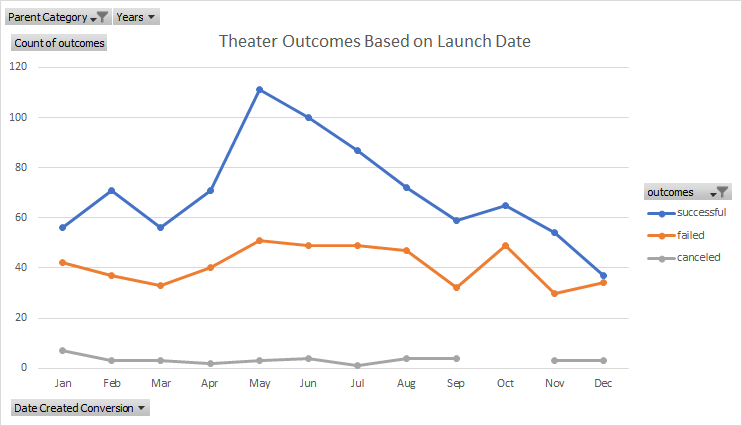
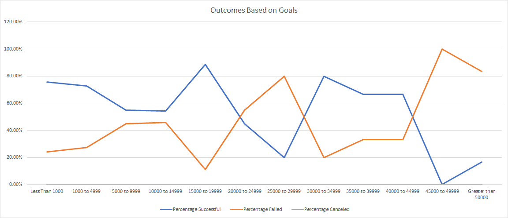

# Kickstarter Analysis - Berkeley DA
Yae Jin Park
Module 1: Kickstarting with Excel

## Project Overview
### Purpose
As becoming familiar with Excel is the first step to become a successful data analyst, this project's purpose is exactly that - do an analysis on a given set of kickstarter projects data with what I was taught over the past week. I was provided with a set of data regarding the status of multiple kickstarter projects in a varying categories of entertainment and my goal is to target and extract certain parts of the data to analyze with tools in Excel (mainly the pivot chart, line graphs and basic statistics functions in Excel).

The first analysis was done on 'theater' category of the kickstarter projects using the pivot chart and a line graph.
During this analysis, I demonstrated how I can utilize the rows, columns, values, and filters on a pivot chart in order to produce a more human-friendly analysis chart to deduce a conclusion for theater kickstarter projects based on their launch dates.

The second analysis was done on the outcomes of the 'play' category of the kickstarter projects by using the COUNTIF() function in Excel and a line graph.
For this demonstration, I counted projects that were successful, have failed, or have been cancelled with the mentioned function and compared their percentages and displayed them on a line chart.

## Analysis and Challenges
### Analysis on Outcomes Based on Launch Date
With the pivot table, I rearranged the data to show the success/fail/cancel rates for each month of all years in the dataset. Looking at the 'Grand Total' column on the far right, which counts all projects regardless of their status in the same month for all years, I was able to check that all months had no alarming outliers (e.g. there was no month that had 5000 theater projects when other months had somewhere around 70-160). However, with just numerical values, it was difficult to visualize what exactly is going on and so a line graph was produced based on the statuses of the projects for each month of all years. Below is the line plot created based on the pivot table with the success/fail/cancel rate for each month of all years.

Until April, there is no definite pattern for the statuses of the projects. However, there's a spike of success in May that starts to decline to a similar number of successful outcomes in September to that of March. The 'failed' rate does not follow the same pattern and as such creates a considerable gap between the success data points in May-July and the fail data points in the same months. From this pattern, I can say that theater projects are relatively more successful from May to July. 

However, in the months of September to November, the success rate of the play projects show a slight 'spike' in October and then fall drastically throughout until December. The fail rate in the same time period show a similar pattern, but the 'spike' is steeper than that of the success rate, which results in a smaller gap between the success line and the fail line. The smaller gap and the steeper spike in the fail line indicates that though play projects may slightly be more successful in October than in September and November, the fail rate is even higher and so I'm hesitant to say that October is the 'rebound' month from the previous months' decline.

December is likely to be the worst month for play projects because the success rate and the fail rate is almost the same, with the success rate being the lowest among the 12 months. This month is also when a theater project is more likely to fail (though slightly) than it would in November.

Because all value of outcomes for success and fail are significantly higher than that of cancelled projects, it is difficult to form a conclusion for cancellation rates based on the line plot. However, even with the numerical values on the pivot chart, it is still difficult to deduce a conclusion for the cancel rates because the values are very small and prone to bigger margins of error. The only visible significance is that play projects have the highest cancellation rate in January, at 7 cancelled projects.

### Analysis of Outcomes Based on Goals
Using the COUNTIF() function in Excel, I was able to count the number of play projects separately based on their goal statuses and their goal amounts. For arguments in the function, I utilized the logical operators "<,>,=<,=>" to set the boundaries for the goal amounts and to count only the projects that are under the category of 'play.' Then, I was able to calculate the percentage of the projects' statuses based on the total number of projects within a certain category of goal mounts, which then allowed me to produce a line plot with three lines. Each line represents the success/fail/cancel percentage of the play projects.

However, line plot produced by the above calculation was difficult to form a conclusion with, as there was no distinct pattern for the success and fail rates (cancel rates were 0% in all categories, so that was not too difficult to see). Below is the line plot created based on the calculations.

The only 'pattern' noticeable from this data is that the success rate and the fail rate of the projects are almost mirroring each other (as in a horizontal 'flip'). When there's an upward spike in the success rate, there's a downward spike in the fail rate and vice versa. This indicates that at certain ranges where the projects are successful, the likelihood of failing is significantly lower.

Most successful ranges (where the success plot is above the fail plot) for the projects have the goal amounts of $15000-$19999, $30000-$34999, $35000-$39999, and $40000-49999. The most likely ranges for the projects to fail in are at $25000-29999, $45000-$49999 and above $50000.

The spike of failure at the range of $25000-$29999 seems to be the unexpected part of the line plot. Why is it that only in this category (aside from the extreme < $50000) there is a higher failure rate?

## Results
### Outcomes Based on Launch Date
Quantative analysis aside, it can be deduced that theater projects are the most popular in spring and the least during winter. Possible reasons may be the weather (some theaters are for outdoor performances), or, looking at how many projects there are in spring, demands may have simply increased due to the increase of supply, providing theater fans more variety of selections in entertainment.

### Outcomes Based on Goals
The resulting line plot is rather surprising because my hypothesis was that there would be an upward trend for the failure rate of the projects and a downward trend for the success rates. It seemed logical to assume that as the goal amounts got bigger, the failure rates would increase as well, but that does not seem to be the case with this dataset. Because there is no distinctive pattern with the line plots, it is diffcult to deduce a conclusion. 

I cannot answer why there is a large number of failed projects in the $25000-29999 range but higher success rates (and significantly lower fail rates) in the boundaries before and after it, but a possible answer is that only certain types of projects fall in that goal range and those projects are more likely to fail than other categories. If there was a way for me to include project categories for the projects in each datapoint of the line plots, I might see a pattern. My conclusion is that unless the projects' goals are extremely high, there is another factor affecting the success/fail outcome of the projects.

### Challenges on Data Analysis
The most difficult part of this challenge was knowing which columns of the dataset to insert in the row/column/filter/value boxes of the pivot chart. Initially, I inserted the 'Date Created Conversion' column in the Columns section, resulting in a very weird looking pivot chart with quite a long row of selection of years. I'm still not very familiar with which data column goes where in the pivot table field. Luckily, it was easy to fix with a simple drag and drop and trying out multiple combinations of data columns allowed me to get the format of the pivot table I desired.

### Limitations of the Dataset
The limitation of this dataset I noticed is that even though it has thousands of rows, it still is a very small dataset. I was surprised because when I rearranged the data for the two plots, I still only got a handful of them to analyze (couple hundreds) and I'm not certain if that's enough to create analysis visuals that accurately represent the whole data. Even if there are thousands of rows, when divided into subcategories, there weren't that much data in each subcategories.

Another type of chart that could have helped with this analysis is perhaps the bubble chart. Obviously, there are some categories of the projects that are bigger in quantity than other categories and a bubble chart might have let me know how much the data is skewed towards the popular projects. The popular categories might be more successful even with bigger goals, maybe not. It would be interesting to see biases in this dataset in another visual.